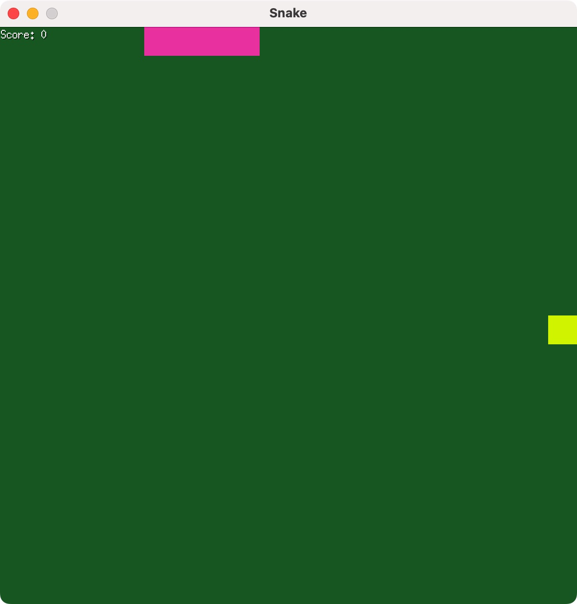

# ebiten-snake
A simple snake game written in Go using the ebiten library.



## Run in binary
```bash
go run main.go
```

## Run in WebAssembly
### Install wasmserve
```bash
go install github.com/hajimehoshi/wasmserve@latest
```
### Compile into webassembly
```bash
wasmserve .
```

### Start to play
Visit http://localhost:8080 to start playing the game.